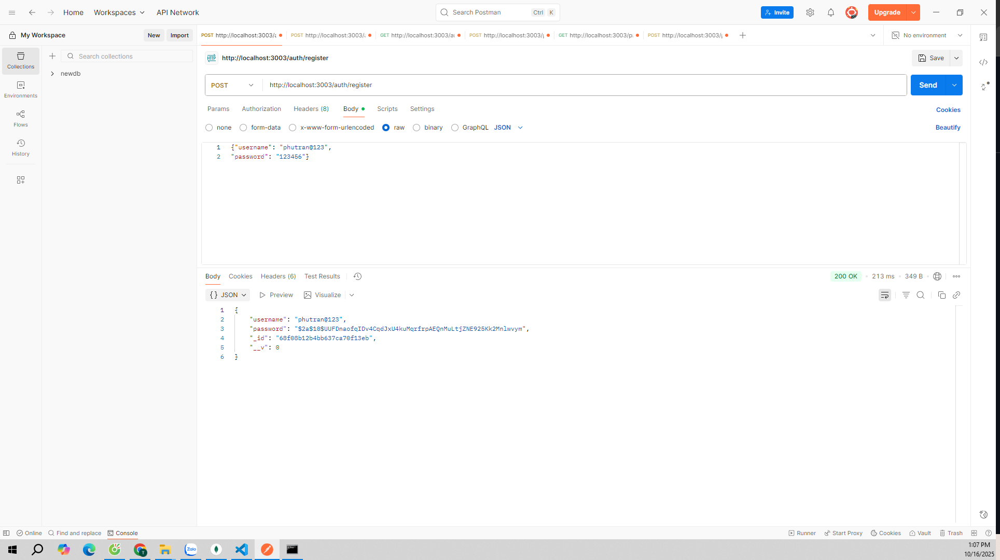
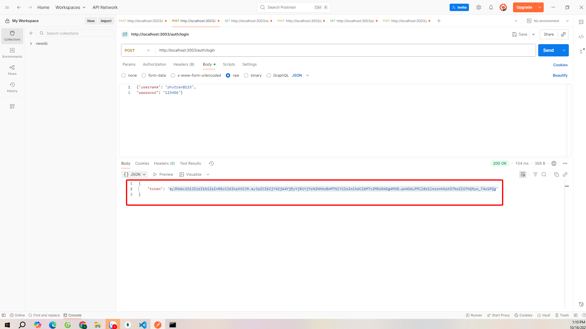
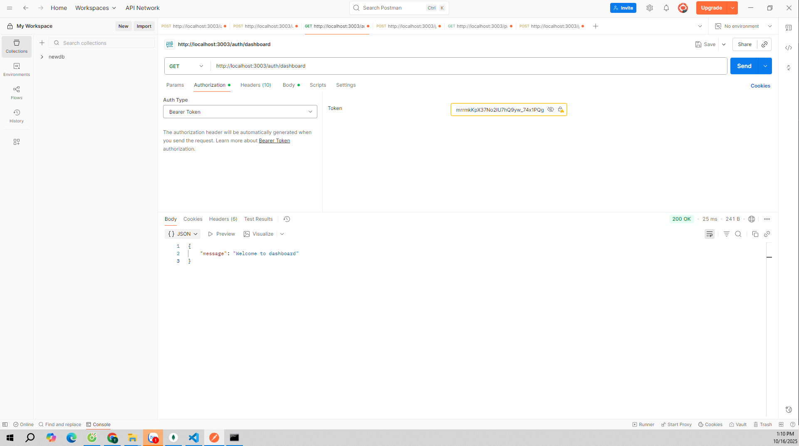
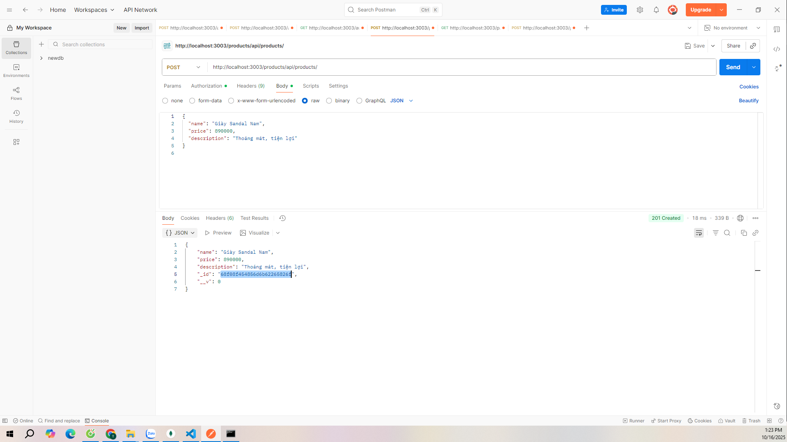
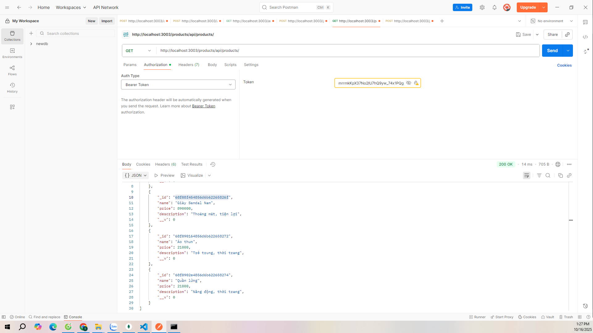
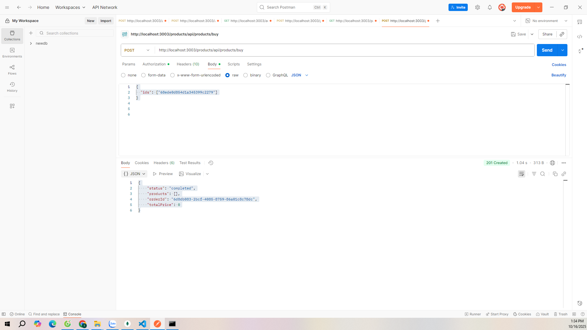

# 🧩 EProject – Microservices System

## 📌 Tổng quan

Dự án mô phỏng **hệ thống thương mại điện tử** sử dụng **kiến trúc Microservices**, bao gồm 3 dịch vụ chính và một API Gateway:

- **Auth Service:** Quản lý đăng ký, đăng nhập và xác thực người dùng.
- **Product Service:** Quản lý sản phẩm, hỗ trợ tạo đơn hàng.
- **Order Service:** Tiếp nhận đơn hàng thông qua RabbitMQ và xử lý hoàn tất.
- **API Gateway:** Là trung gian tiếp nhận, định tuyến và điều phối các request giữa các service.

---

## 🛠️ Công nghệ sử dụng

- **Node.js / Express** – Nền tảng backend chính
- **MongoDB / Mongoose** – Quản lý và lưu trữ dữ liệu
- **RabbitMQ (Message Queue)** – Giao tiếp bất đồng bộ giữa các service
- **JWT (JSON Web Token)** – Xác thực người dùng
- **Postman** – Kiểm thử API
- **Visual Studio Code** – Môi trường phát triển

---

## 🧭 Kiến trúc hệ thống

```bash

[Client]
↓
[API Gateway]
├── Auth Service
├── Product Service
└── Order Service
↑
[RabbitMQ]
```

---

## 🗂️ Cấu trúc thư mục\*\*

```bash
.
├── api-gateway/         # API Gateway
├── auth/                # Authentication Service
├── order/               # Order Service
├── product/             # Product Service
├── .env                 # File môi trường chính (RabbitMQ)
├── .gitignore           # Bỏ qua các file không cần commit
├── docker-compose.yml   # Định nghĩa & kết nối các container
└── README.md            # Tài liệu mô tả dự án
```

---

## 🧱 Cài đặt và khởi chạy dự án

### 🧾 Yêu cầu hệ thống

- [Docker](https://www.docker.com/)
- [Docker Compose](https://docs.docker.com/compose/)
- [Git](https://git-scm.com/)

---

### 📝 Bước 2: Tạo các file môi trường `.env`

Dự án sử dụng nhiều file `.env` để lưu biến môi trường. Tạo theo hướng dẫn sau:

#### 📁 `.env` tại thư mục gốc

```bash
RABBITMQ_USER=myuser
RABBITMQ_PASS=mypassword
```

### 🐳 **Bước 3: Khởi động hệ thống bằng Docker Compose**

```bash
docker compose up --build -d
```

### 🧭 **Bước 4: Kiểm tra trạng thái container**

```bash
docker compose ps
```

**Kết quả mong đợi:**

- Khoảng 8 container ở trạng thái Up gồm:

* 3 service chính
* 3 MongoDB
* 1 RabbitMQ
* 1 API Gateway

## 🌐 5. Sử dụng & kiểm thử API

### 📍 API Gateway

Tất cả các request đều được gửi thông qua API Gateway tại địa chỉ:

```
http://localhost:3003
```

---

### 📊 Danh sách Endpoint

| **Chức năng**      | **Method** | **Endpoint**   | **Xác thực**      |
| ------------------ | ---------- | -------------- | ----------------- |
| **Authentication** | POST       | /auth/register | ❌                |
|                    | POST       | /auth/login    | ❌                |
| **Products**       | GET        | /products      | ✅ (Bearer Token) |
|                    | POST       | /products      | ✅                |
| **Orders**         | POST       | /orders        | ✅                |
|                    | GET        | /orders        | ✅                |

---

### 🧪 Bước 5: Kiểm thử bằng Postman

1. Mở **Postman**.
2. Gửi request:

   ```http
   POST http://localhost:3003/auth/register
   ```

   → **Đăng ký tài khoản mới**

   3. Gửi request:

   ```http
   POST http://localhost:3003/auth/register
   ```

   → **Đăng nhập và nhận JWT Token**

3. Dùng **JWT Token** để gọi các API có bảo mật (ví dụ: `/products`, `/orders`).

> 💡 **Lưu ý:Trước khi kiểm thử, hãy đảm bảo RabbitMQ và MongoDB đã chạy ổn định.**.

## HÌNH ẢNH KIỂM THỬ

## đăng kí tài khoản:



## đăng nhập:



## nhận token đăng nhập:


## xem thông tin người dùng:



## tạo sản phẩm:



## xem danh sách sản phẩm:



## mua sản phẩm:


